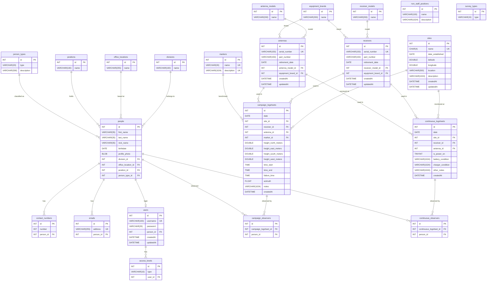

# Legacy Data Model — `gpsdb_rev` (Extracted from Deprecated/Archived Oriel Codebase, ~2017–2019)

**Source:** `packages/CORS-dashboard/oriel/gpsteamapi/sql/` — Node.js/Express + Sequelize 4 + MySQL  
**Status:** Superseded. No active deployment. Forensic reference only.  
**Extracted:** 2026-05-06  
**Extraction method:** Sequelize model files (`sql/models/*.js`) + raw SQL stored-proc calls (`server_crustal_deformation/routes/index.js`) + connector associations (`sql/connector.js`)  

---

## Background

`gpsdb_rev` was the MySQL database backing the original PHIVOLCS GPS Team web app ("Oriel"). It stored field logsheet data (campaign and continuous GPS), equipment inventory, and staff records. The system was never fully completed — several Sequelize associations were declared in `connector.js` but their model files were never written, and `force: true` was left in the sync call (data-destructive on restart).

This document is the authoritative reconstruction of that schema for alignment and migration planning. See [`legacy_codebase_alignment.md`](../legacy_codebase_alignment.md) for the broader porting roadmap.

---

## Entity-Relationship Diagram

---

## Table Inventory

### Equipment

| Table | Purpose | Notes |
|---|---|---|
| `equipment_brands` | Lookup: manufacturer (e.g., Leica, Trimble) | Shared by receivers and antennas |
| `receiver_models` | Lookup: GNSS receiver model name | Used for RINEX header cross-check (BRN-006) |
| `receivers` | Physical receiver units — serial-tracked | `retirement_date` marks decommissioned units |
| `antenna_models` | Lookup: antenna model name (RINEX/IGS format) | Used for ATX cross-check (BRN-006) |
| `antennas` | Physical antenna units — serial-tracked | `retirement_date` marks decommissioned units |

### People & Organisation

| Table | Purpose | Notes |
|---|---|---|
| `divisions` | PHIVOLCS organisational divisions | |
| `office_locations` | Physical office addresses | |
| `positions` | Staff job titles | |
| `non_staff_positions` | Contractor/consultant roles | Parallel lookup, not linked to `positions` |
| `person_types` | Classification (staff, consultant, student, etc.) | |
| `people` | Core personnel record | FK to divisions, office_locations, positions, person_types |
| `contact_numbers` | Phone numbers — one-to-many per person | |
| `emails` | Email addresses — one-to-many per person | |
| `users` | Login credentials | Links to `people`; password stored as plain VARCHAR(20) — insecure, never deployed to production |
| `access_levels` | Role-based access control levels | The only explicit Sequelize association defined |

### Field Sites

| Table | Purpose | Notes |
|---|---|---|
| `sites` | GNSS monitoring station | 4-char code (`CHAR(4)`) matches IGS/Bernese station naming |
| `markers` | Geodetic benchmark descriptions | Referenced per logsheet occupation |
| `survey_types` | Campaign vs continuous lookup | `id` is `INT(1)` — intentionally small enum-style table |

### Logsheets

| Table | Purpose | Notes |
|---|---|---|
| `campaign_logsheets` | Per-occupation record for campaign (temporary) GPS surveys | Height measured in 4 cardinal directions for avg slant-height |
| `continuous_logsheets` | Periodic maintenance visit log for permanent CORS stations | Records power/battery/charger status |
| `campaign_observers` | Junction: who observed a campaign session | **Model file missing** — declared in connector.js, never implemented |
| `continuous_observers` | Junction: who visited a CORS station | **Model file missing** — declared in connector.js, never implemented |

---

## Reconstruction Confidence

| Claim | Confidence | Source |
|---|---|---|
| Column names and types | High | Sequelize model files (authoritative) |
| `access_levels.user_id` FK | High | Explicit `AccessLevel.belongsTo(User)` in connector.js |
| Logsheet FKs (`site_id`, `receiver_id`, `antenna_id`, `marker_id`) | High | Raw SQL calls in `server_crustal_deformation/routes/index.js` |
| `people` FKs (`division_id`, `position_id`, `office_location_id`) | High | Stored-proc parameters in routes |
| `contact_numbers.person_id`, `emails.person_id` | Medium | Domain inference; no explicit SQL found |
| `users.person_id` | Medium | Domain inference (users are people with logins) |
| `receivers/antennas` → `*_models` / `equipment_brands` | Medium | Domain inference; separate lookup tables exist but no FK SQL found |
| `campaign_observers` / `continuous_observers` structure | Low | Naming convention only; files absent |

---

## Gaps and Known Issues

- **Plain-text passwords** in `users.password` (`VARCHAR(20)`) — the system was never hardened for production deployment.
- **`force: true`** left in `db.sync()` in `connector.js` — would drop and recreate all tables on every server restart.
- **Missing model files**: `campaign_observers.js` and `continuous_observers.js` are imported in `connector.js` but do not exist in `models/`.
- **`non_staff_positions`** has no FK relationship defined anywhere — likely intended as an alternative to `positions` for contractors but never wired up.
- **`survey_types`** has no FK in any logsheet table — possibly intended to tag logsheets by survey type but never linked.
- **GraphQL schema** (`gpsteamapi/api/graphSchema.js`) is an empty stub — the API layer was never completed.
- **No timestamps on `campaign_logsheets`**: only `createdAt` (no `updatedAt`), unlike most other tables.

---

## Alignment with Current Schema (`pogf-geodetic-suite` / `field_ops`)

| Legacy concept | Current equivalent |
|---|---|
| `sites` (CHAR 4 code, lat/lon) | `stations` in central PostgreSQL schema (PostGIS `GEOMETRY(Point,4326)`) |
| `receivers` + `receiver_models` | Validation source for `rinex_header_validator.py` (BRN-006) |
| `antenna_models` | ATX cross-check in `rinex_header_validator.py` (BRN-006) |
| `campaign_logsheets` | `field_ops.logsheets` (Phase 1A, services/field-ops/) |
| `continuous_logsheets` | No direct equivalent yet — absorbed into vadase-rt-monitor station config |
| `people` / `users` / `access_levels` | Not yet ported — out of current phase scope |
| `markers` | Not yet ported |
